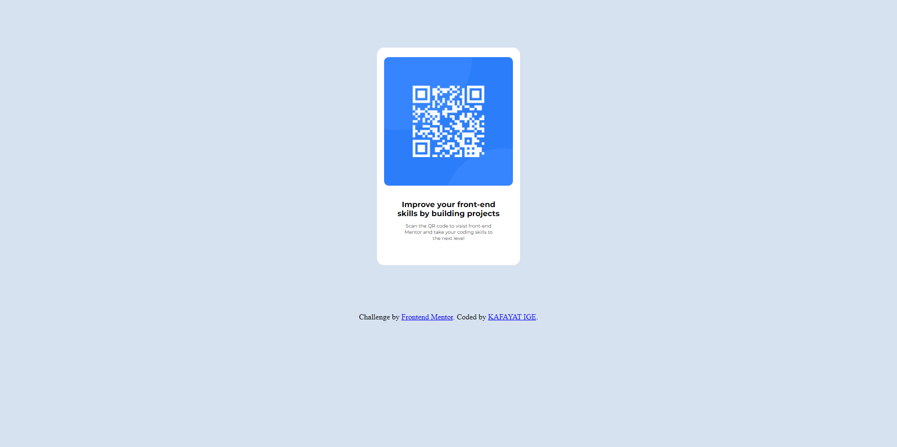

# Frontend Mentor - QR code component



## Welcome! 👋
# Frontend Mentor - QR code component <!--KAFAYAT IGE--> solution

This is a solution to the [QR code component challenge on Frontend Mentor](https://www.frontendmentor.io/challenges/qr-code-component-iux_sIO_H). Frontend Mentor challenges help you improve your coding skills by building realistic projects. 

## Table of contents

- [My Wireframe](#overview)
  - [MyfinalScreenshot]
  - [Links](#links)
- [My process](#my-process)
  - [Built with](#built-with)
  - [What I learned](#what-i-learned)
  - [Continued development](#continued-development)
  - [Useful resources](#useful-resources)
- [Author](#author)


## Wireframe


### Screenshot


### Links

- Solution URL: [Add solution URL here](https://your-solution-url.com)
- Live Site URL: [Add live site URL here](https://your-live-site-url.com)

## My process
- i drew first a wireframe to enable me understand the structure of design.
- I wrote first the structural code using HTML5.
- Outline how each element and item should relate with one another.
With my understanding of flex box and view-port i was able to add CSS component.

### Built with

- Semantic HTML5 markup
- CSS custom properties
- Flexbox


### What I learned

- during the CSS part, i gained critical understanding of how defining some certain property can restrict another from being effective.
-I gained more critical understanding of how the view-port unit such as vh and vw can affect the layout of your design on different platforms.
- there was a point i initially used the flex-basis property which restricted my padding-bottom from being effective
- I learnt that there is always room for optimisation in your code


Use this section to recap over some of your major learnings while working through this project. Writing these out and providing code samples of areas you want to highlight is a great way to reinforce your own knowledge.

To see how you can add code snippets, see below:

```html
<h1>Some HTML code I'm proud of</h1>
     <P class="Bold-text">
             Improve your front-end <span>skills by building projects</span>
           </P>
```
```css
.proud-of-this-css 
  
   .whole{
    display: flex;
    flex-direction: column;
    align-items: center;
    background :hsl(212, 45%, 89%);
    min-height: 100vh;
    min-width: 100vw;
    }


### Useful resources

- [resource 1](https://youtu.be/ZxKM3DCV2kE) - This helped me recao my understanding of ssome CSS properties.
- [ resource 2](https://css-tricks.com/almanac/properties/g/gap/) - This is an amazing article which helped me finally understand gap in flexbox. I'd recommend it to anyone still learning this concept.


## Author

- Website - [Add your name kafayat ige](https://www.your-site.com)
- Frontend Mentor - [@Kafayatige](https://www.frontendmentor.io/profile/Kafayatige)
- Twitter - [@kaffycodes]

